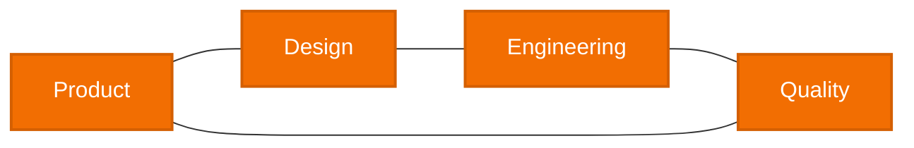

 

### **We design and build production-grade digital products**

 

  

---

## 🔒 About our public repositories

Most of our commercial work is **proprietary and protected by NDAs**, so client source code and project-specific implementation details are kept in private repositories.

> **The number of public repositories here does not reflect the scale or complexity of our engineering work.**

We never publish client code without explicit permission.

For publicly available examples of our work, visit our **[Case Studies](https://moodup.team/portfolio/)**.

---

## 🚀 What we build

<table>
<tr>
<td width="50%" valign="top">

### 📱 Mobile Apps
- Native iOS & Android
- Flutter & React Native
- Offline-first applications
- Consumer & enterprise products
- Real-time mobile experiences

</td>
<td width="50%" valign="top">

### 📡 IoT & Connected Devices
- Bluetooth Low Energy
- Smart Home ecosystems
- HomeKit integrations
- Connected hardware
- Sensors & real-time communication

</td>
</tr>

<tr>
<td width="50%" valign="top">

### 🌐 Web Platforms
- SaaS products
- B2B applications
- Dashboards
- Customer portals
- Internal tools

</td>
<td width="50%" valign="top">

### ⚙️ Backend & AI Systems
- APIs & integrations
- Cloud-connected backends
- Real-time services
- Scalable infrastructure
- AI-enabled product functionality

</td>
</tr>
</table>

---

## 🧭 From idea to production

**We can take ownership of the full delivery process or integrate with an existing engineering team.**

---

## 🛠 Technology

We choose technologies based on **product requirements, maintainability, scale and long-term business value**.

<table>
<tr>
<td valign="top" width="50%">

### Mobile
- `Kotlin`
- `Java`
- `Swift`
- `Objective-C`
- `SwiftUI`
- `UIKit`
- `Flutter`
- `Dart`
- `React Native`

### Web
- `JavaScript`
- `TypeScript`
- `React`
- `Redux`
- `Next.js`
- `Gatsby`
- `Angular`
- `RxJS`
- `HTML`
- `SCSS`

</td>
<td valign="top" width="50%">

### Backend & Infrastructure
- `Node.js`
- `NestJS`
- `Express`
- `Java`
- `Spring`
- `PostgreSQL`
- `MongoDB`
- `Redis`
- `AWS`
- `Docker`
- `Firebase`

### QA / Delivery / Monitoring
- `Bitrise`
- `CircleCI`
- `Jenkins`
- `Fastlane`
- `Jest`
- `Cypress`
- `Appium`
- `XCTest`
- `Postman`
- `Sentry`
- `Crashlytics`

</td>
</tr>
</table>

<strong>View extended stack</strong>

 

| Area | Technologies |
|---|---|
| **Android Native** | Kotlin, Java, Android SDK, Android Jetpack, Jetpack Compose, Hilt, Dagger, Room, Realm DB, Retrofit, OkHttp, RxJava, Gson, Glide, Gradle |
| **iOS Native** | Swift, Objective-C, SwiftUI, UIKit, Combine, RxSwift, RxCocoa, Core Data, Swift Package Manager, XCTest |
| **Cross-platform** | Flutter, Dart, React Native, BLoC, Flutter Hooks, Flutter Modular |
| **Frontend** | JavaScript, TypeScript, React, Redux, Next.js, Gatsby, Angular, RxJS, JSX, HTML, SCSS |
| **Backend** | Node.js, TypeScript, NestJS, Express, Java, Spring, PostgreSQL, MongoDB, Redis, Meteor.js, Parse |
| **API / Integrations** | REST API, JSON:API, WebRTC, Twilio, Intercom, Adyen, In-App Purchase |
| **IoT / Device Communication** | Bluetooth Low Energy, HomeKit, WebRTC, REST API, Firebase, real-time communication |
| **Firebase Ecosystem** | Firebase, Firebase Realtime Database, Firebase Cloud Functions, Firebase Analytics, Crashlytics |
| **CI/CD & DevOps** | Git, CI/CD pipelines, Bitrise, CircleCI, Jenkins, Fastlane, Gradle, Swift Package Manager |
| **Testing & QA** | Jest, React Testing Library, Postman, Cypress, Appium, Cucumber, XCTest, QA Automation |
| **Monitoring / Observability** | Sentry, Crashlytics, Firebase Analytics, Flurry |
| **UX/UI & Product** | Figma, FigJam, Material Design, Material UI, Human Interface Guidelines, Jira, Confluence, Lokalise |

---

## ✅ Engineering principles

<table>
<tr>
<td width="33%" valign="top">

### 🏗 Architecture
We design systems with clear boundaries, predictable data flows and practical scalability.

</td>
<td width="33%" valign="top">

### ✅ Quality
We emphasize code reviews, automated testing, static analysis and maintainable codebases.

</td>
<td width="33%" valign="top">

### 🚀 Delivery
We use CI/CD, incremental releases, monitoring and production-focused engineering practices.

</td>
</tr>
</table>

### Pragmatism over hype

- Not every product needs microservices.
- Not every mobile app should be cross-platform.
- Not every system needs complex cloud infrastructure.

> **The right solution is the one that solves the product problem and remains maintainable over time.**

---

## 🤝 How we can help

<table>
<tr>
<td width="33%" valign="top">

### New Products
- Discovery
- UX/UI
- Architecture
- Engineering
- QA & release
- Maintenance

</td>
<td width="33%" valign="top">

### Existing Products
- New features
- Modernization
- Technical debt reduction
- Reliability improvements
- Performance optimization
- CI/CD improvements

</td>
<td width="33%" valign="top">

### Team Extension
- Mobile engineers
- Frontend engineers
- Backend engineers
- QA engineers
- Product & design support
- Integrated delivery teams

</td>
</tr>
</table>

---

## 🌍 Experience

## **12+ years · 110+ projects · 10+ countries**

  
  
  
  
  
  
  
  
  

### Selected engineering challenges
- Bluetooth Low Energy and connected hardware
- Smart Home ecosystems
- Offline-first mobile applications
- Real-time communication
- Audio and media streaming
- Third-party payments and integrations
- Native and cross-platform mobile development
- Complex web applications
- Cloud-connected backend systems

### [Explore our Case Studies →](https://moodup.team/portfolio/)

---

## 🔄 How we work

Strong products are built when **product, design, engineering and quality work together**.

---

## 🧩 Evaluating Mood Up?

If you received this GitHub profile during vendor evaluation, we recommend looking at:

- **GitHub** — public engineering work we are able to share
- **Case Studies** — selected products and project experience
- **Technical Discussion** — architecture, mobile, IoT, backend, testing, CI/CD, scalability
- **Relevant References** — where contractual terms allow

---

## Let's build something

### Tell us about the product and the problem you're trying to solve.

 

  

**Mood Up**  
Mobile Apps · IoT · Web Platforms · Custom AI Systems  
Poznań, Poland · Working internationally

